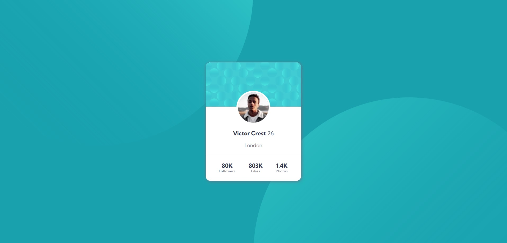

# Frontend Mentor - Profile card component solution

This is a solution to the [Profile card component challenge on Frontend Mentor](https://www.frontendmentor.io/challenges/profile-card-component-cfArpWshJ). Frontend Mentor challenges help you improve your coding skills by building realistic projects. 

## Table of contents

- [Overview](#overview)
  - [The challenge](#the-challenge)
  - [Screenshot](#screenshot)
  - [Links](#links)
- [My process](#my-process)
  - [Built with](#built-with)
  - [What I learned](#what-i-learned)
  - [Continued development](#continued-development)
- [Author](#author)

## Overview

### The challenge

- Build out the project to the designs provided

### Screenshot



### Links

- Solution URL: [Github source code link](https://github.com/R3B3-888/Profile-card-component)
- Live Site URL: [Github page link](https://r3b3-888.github.io/Profile-card-component/)

## My process

### Built with

- Semantic HTML5 markup
- CSS custom properties
- Flexbox

### What I learned

```css
.proud-of-this-css {
  background: url("images/bg-pattern-top.svg") no-repeat right 50vw bottom 40vh, url("images/bg-pattern-bottom.svg") no-repeat left 50vw top 40vh, var(--dark-cyan);
}
```

### Continued development

Aranged the london to be more accurate to the design.

## Author

- Website - [Alexis Hoffmann](https://alexis-hoffmann.emi.u-bordeaux.fr/)
- Frontend Mentor - [@@R3B3-888](https://www.frontendmentor.io/profile/R3B3-888)
